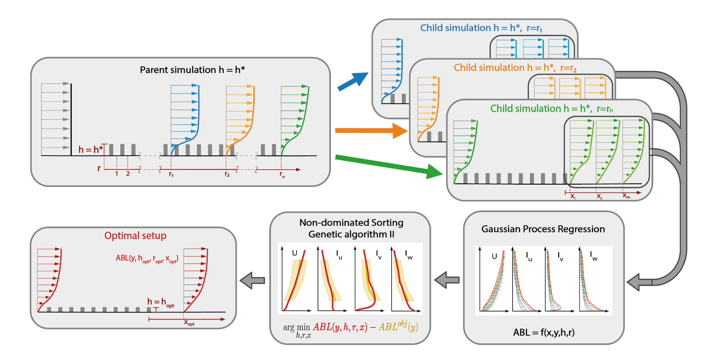

# Inflow Generation for Computational Wind Engineering🚀

[](https://www.python.org/)
[](LICENSE)

---

## ​ Table of Contents

- [Introduction](#introduction)  
- [Features](#features)
- [Symbols](#symbols)
- [GPR Model](#GPRMode)  
- [Inflow optimization](#inflow-optimization) 
- [Domain generation](#domain-generation)  
- [Project Structure](#project-structure)
- [Select Results](#select-results)

---

## ​ Introduction

This repository contains tools for **generating target inflow profiles** for **computational wind engineering** purposes.

For running CharLES, you on need to do the inflow optimaization and domain generation. For other solvers, need to run the full thing (fit GPR models).

---

## ​ Features

- Python-based framework—compatible with Python 3  
- Includes scripts for:
  - General-purpose functions used by most repo scripts ([`modelDefinition.py`](./modelDefinition.py)) 
  - Generating an ABL from ASCE 49-21 ([`ASCEMattia.py`](./ASCEMattia.py))
  - Gaussian process regression models hyperparameters tuning ([`fitModel.py`](./fitModel.py), [`resultsToDatabase.py`](./resultsToDatabase.py))
  - Optimizing inflow generator inputs to achieve a target ABL ([`optimizeParameters.py`](./optimizeParameters.py))
  - Generate CharLES domain for an ABL simulation ([`resultsToDatabase.py`](./resultsToDatabase.py), [`paperPlots.py`](./paperPlots.py))

---

## Symbols
- $H$ of $H_{Build}$: height of building
- $y$: non-dimensionalized vertical coordinate system.
  - $y^T$: top of the domain in the paper
  - $y^{Max}$ or $\alpha$: new domain height suggested by the GPR model (called $y^{Max}$ in the paper and `alpha` in the code)
    - Note that `yMax` in the code is instead the (model scale) domain height **not** the opeimized height
  - `scale`: in the code, `scale` is $y^{Max} / y^T$
    - Note that the building height in the optimized downstream simulation would be $H y^{Max} / y^T$ or equivalently `H * scale`
- $h$: height of rougness elements
- $r$: number or roughness elements in upstream simulation
- $k$: velocity scaling factor, enabling the profile to be scaled to the target profile. This assumes high reynolds limit.
- $x$: this is the distance between the last upstream element and the building (or start of buildings)


## ​ GPR Model
### Hyperparameters
Hyperparameters (and some other similarly used variables like model IDs) are defined in [`hyperparametersGPR.py`](./hyperparametersGPR.py) and imported into other scripts.

### Scripts


Scripts [`fitModel.py`](./fitModel.py) and [`resultsToDatabase.py`](./resultsToDatabase.py) can be used to perform the GPR model hyperparameters tuning. You need to run the script at least two times. One to fit the GPR model on the upstream database (inflow generator inputs), and one to fit the downstream database (target ABLs). The syntax to run the scripts is 

`python3.9 fitModel.py '[x1,x2,x3]' setToFit`

where x1,x2,x3 are the x locations at which you want to fit the model (read the paper for more info), while setToFit can be Gridsearch, Inflow, or Plot. Gridsearch fits the downstream database for y in [0;1m], while Inflow fits the upstream database for y in [0;1.5m]. I'll focus on the Plot option later.



To properly run the script, you first need to define the QoIs for the fit (QoIs = ['u','Iu','Iv','Iw'] for Gridsearch, and QoIs = ['u','uu','vv','ww','uv'] for Inflow), yMax (1.0 for Gridsearch and 1.5 for Inflow) and then the TestID, which is the name of the output folder containing the GPR models fitted during the hyperparameter search. Each model is saved as GPRModels/xxx_TestID_QoI/yyy.pkl, where xxx is the x location at which the hyperparameter tuning is performed, QoI is the specific quantity of interest (e.g. uu or Iw), and yyy is the specific model identifier.

Once the gridsearch terminates, the [`resultsToDatabase.py`](./resultsToDatabase.py) scripts save the models that yields the best predictions on the dev set. The command to run this script is 

`python3.9 resultsToDatabase.py`

To properly run the script, you need to modify testID to reflect the name of the model, xList to define the x location at which you preformed the gridsearch, and the QoIs (quantities). For each QoI and x location, the code will sort the predictions of each model fitted during the hyperpameter tuning phase and save the best one based on the RMSE of the predictions on the dev set. The model will be saved in the GPRModels folder.

At this point, you can plot the predictions of the best models on the train, and either the dev or the test set by running the command

`python3.9 fitModel.py '[x1,x2,x3]' Plot`

To visualize either the Test set or the Dev set predictions, you need to define setToPlot = 'Dev' or setToPlot = 'Test', respectively. 

You can find many models I tested on Sherlock in the /oak/stanford/groups/gorle/mattiafc/GPRModels folder. The best upstream database model TestID is 
`inflow_stresses`, while the best downstream database model TestID is `intensities`.

---

## ​ Inflow optimization

To find the optimal inflow parameter setup required to represent a target ABL, you need to run the [`optimizeParameters.py`](./optimizeParameters.py) script with the command

`python3.9 optimizeParameters.py mode`

where mode can be 'Optimize-Gridsearch','Optimize-NSGA','Plot-Gridsearch','Plot-NSGA', or 'Plot-Setup'.

First, you need to run the script with the `Optimize-NSGA` option. To do so, you need to first add the target abl (let's say it's called fName.dat) in the TestCases folder and then modify the fNames variable to reflect the file identifier (e.g. fName.dat). I suggest specfying the target ABL for y in [0.25H;1.5H], where H is the building height. At this point, you need to modify testID to reflect your model name choice, the target QoIs, and the number of CPU you want to use during the optimization (e.g. 128 on sherlock). The optimization will generate two .csv files, namely fName_decision_variables.csv and fName_pareto_front.csv which contains the decision variable values and the RMSE of the optimal solution with respect to the target value for the QoIs, respectively.

At this point, you can look at the output of the optimization by running

`python3.9 optimizeParameters.py Plot-NSGA`

to look at the parallel coordinate plots of the Pareto front (useful only the first few times you run the optimization), or

`python3.9 optimizeParameters.py Plot-Setup`

to look at specific solutions (seeds) on the pareto front. This will generate a single plot that compares multiple optimal solutions with the target value for the QoIs. 

---

## ​ Domain Generation

Once the optimization is over, you can use the [`generateInflow.py`](./generateInflow.py) script. 

[`caseConfig.json`](./caseConfig.json) includes the editable configuration settings, including `reference` and `scaleFactors` dictionaries as well as a `plotABL` boolean. `reference` includes `fName` of the target ABL, the optimal $h$, $r$, $\alpha$, $k$, and $x$ values, and `hMatch` which I believe only impacts plotting. `scaleFactors` includes the simulation scale, (full)scale building height, and the velocity scaling factor. If `plotABL` is true, `fName` must match a target ABL profile (./TestCases/{`fName`}.dat). As discussed in the Inflow optimization section, HABL is then calculated as 1.5 times the height of the full-scale building. You also need to specify the testID of the models fitted on the upstream and the downstream databases. 

`python3.9 generateInflow.py`

you will see a new folder called 'fName_geoemtric_1toXXX' where XXX is the scale you defined. This folder will contain an .sbin charles domain ready to be meshed with pointcloud probes. You can use this domain to verify the optimizations results.

## Select Results
### ASCE Boundary Layers
To demonstrate the capabilities of the proposed framework, we use it to replicate ABLs corresponding to ASCE 49-21 terrain categories B, C, and D, corresponding to urban/suburban, open, and flat terrain, respectively. These terrain categories are characterized by full-scale roughness heights y0 of 0.3m, 0.02m, and 0.005m, respectively. We adopt a reference wind speed of 12m/s at a height of 10m, ensuring a fully rough surface Reynolds number in accordance with ASCE 49-21 requirements for wind tunnel testing.

We consider three buildings with different full-scale heights H: a low-rise building (LRB) with $H = 6m$, a mid-rise building (MRB) with $H = 30m$, and a high-rise building (HRB) with $H = 100m$. For each case, we compute the target ABL velocity and turbulence intensity profiles for y P r0.25H; 1.5Hs. These target profiles are then used as the targets for the optimization procedure. While the framework supports optimization for multiple QoIs, in this Section we focus on the mean velocity and streamwise turbulence intensity as the target variables. We also conducted an optimization using all four QoIs. However, focusing on the mean velocity and streamwise turbulence intensity produced better overall results.


---

## ​ Project Structure


```
├── 📂 GPRModels/                # Gaussian Process Regression model scripts
├── 📂 RegressionPlots/          # Scripts & notebooks for regression result plots
├── 📂 InflowGeneration/         # Main package for inflow generation
│   ├── 📄 codeABLs.py            # Atmospheric boundary layer helper functions
│   ├── 📄 formatSetup.py         # Prepares and formats input setup files
│   ├── 📄 generateInflow.py      # Generates inflow profiles
│   ├── 📄 modelDefinition.py     # Defines inflow model parameters
│   ├── 📄 optimizeParameters.py  # Tunes model parameters for best fit
│   ├── 📄 paperPlots.py          # Creates publication-ready plots
│   ├── 📄 resultsToDatabase.py   # Exports results to database format
│   ├── 📄 verifyInflow.py        # Verifies inflow profiles against targets
│   ├── 📄 ASCEMattia.py          # ASCE-specific configuration utilities
│   ├── 📂 GPRDatabase/           # Data for Gaussian Process Regression
│   ├── 📂 Predictions/           # Generated model predictions
│   └── 📂 TestCases/             # Example input test cases
```
